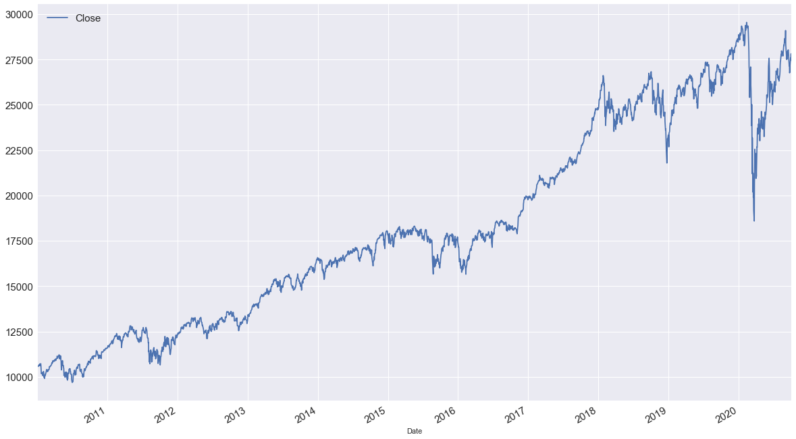

# DJI--Trading-Strategies-

# Dow Jones Industrial Average Trading Strategies

## Getting Started.

1. Clone this repo [Github Pages](https://github.com/Dantarshi/DJI--Trading-Strategies-).

2. Raw Data is gotten from ("https://en.wikipedia.org/wiki/Dow_Jones_Industrial_Average").

3. main notebook link [Github Notebook](https://github.com/Dantarshi/DJI--Trading-Strategies-/blob/main/DJI%20Strategy.ipynb)

## Project Intro/Objective
The purpose of this project is to use stock historical data to develop the best strategy for trading Dow Jones average and to determine the risk associated with the specific strategy.

## Methods Used.
* Web Scrapping.
* Data Visualization.
* etc.

## Technologies 
* Python.
* Seaborn.
* Matplotlib
* Pandas, jupyter.
* Unicodedata
* etc. 

## Project Description.
Dow Jones Industrial Average measures the stock performance of 30 large companies listed on the stock exchanges in the United State.It is the most commonly followed indices in U.S stock market. 
In this project, we will attempt to use the Dow Jones to develop a strategy that will yield profitability over time. although Dow Jones is not traded directly, however, we can invest in a portfolio that has constituents of Dow Jones.

We might know little or nothing about Dow Jones however, we can make use of wikipedia to help us in the process of getting the vital components to use in this project.

We will do a little web scrapping to get the ticker symbols to pull the data from the web API needed for the project.

## Needs of this project.

- data exploration/descriptive statistics.
- data processing/cleaning.
- visualization.
- writeup/reporting.

Research Question: What is the best trading strategy fir Dow Jones and the risk associated with it? 

## Importing and cleaning data.

Data for this project is gotten from https://en.wikipedia.org/wiki/Dow_Jones_Industrial_Average and yahoo finance.

## Data cleaning.

The cleaning of the data includes:
* Checking for null or missing data.
* Getting information on data types.
* Checking the data shapes.
* Getting data summary.
* Droping the null values(since there was only one row missing).
* Checking for duplicates.
* Checking for place holders.

The 30 constituente of Dow Jones.

    0      MMM
    1      AXP
    2     AMGN
    3     AAPL
    4       BA
    5      CAT
    6      CVX
    7     CSCO
    8       KO
    9      DOW
    10      GS
    11      HD
    12     HON
    13     IBM
    14    INTC
    15     JNJ
    16     JPM
    17     MCD
    18     MRK
    19    MSFT
    20     NKE
    21      PG
    22     CRM
    23     TRV
    24     UNH
    25      VZ
    26       V
    27     WBA
    28     WMT
    29     DIS

#### Dow Jones chart.

#### A plot of Dow Jones Chart and Return on the secondary axis.

#### Positions:

+1: Investing in DJI (Long position)

-1: Short Selling DJI (Short Position)

0: No Position (Neutral)

Strategies:

-Buy and Hold ( Basic strategy - passive): Initial investing in DJI and do nothing(Position: +1 on any given day)

Simple Momentum (active strategy to be tested):

1.) Investing (+1) into DJI tomorrow id today return was positive

2.) short selling(-1) tomorrow if today return was negative

#### The plotting our strategy (Simple Momemtum Strategy) against buy and hold strategy

### Back Testing Simple Constrarian Strategy

Strategies

-Simple Constrarian (test)
1.) Short Sell (-1) DJI tomorrow if today's return was positive.

2.) Invest (+1) into DJI tomorrow if today's return was negative.

#### Forward Testing

##### Fitting

When we plot our strategy (Forward Testing) and compare it with DJI

Our strategy out performed DJI buy and hold strategy.

We found a strategy that out performed our basic buy and hold strategy. We still need to further anlysis.
Backtesting vs Fitting was fitted and optimized on historic data. forward testing is definately required. 
Positional chages require cost in some trading platforms and that should be taken into consideration. Tax effects should be taken nto consideration as well

DJI Return = 10.48%, Risk = 17.41%
Fitting Strategy =  20.90%, Risk = 17.37%

#### Simple Moving Averages

20 Day moving average

50 day moving average

200 day moving average

20 day, 50day, 200 day moving average chart!

Comparism
